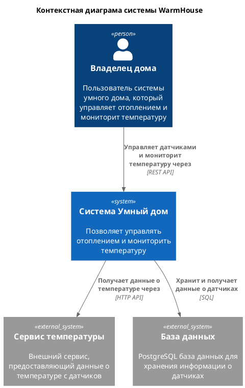
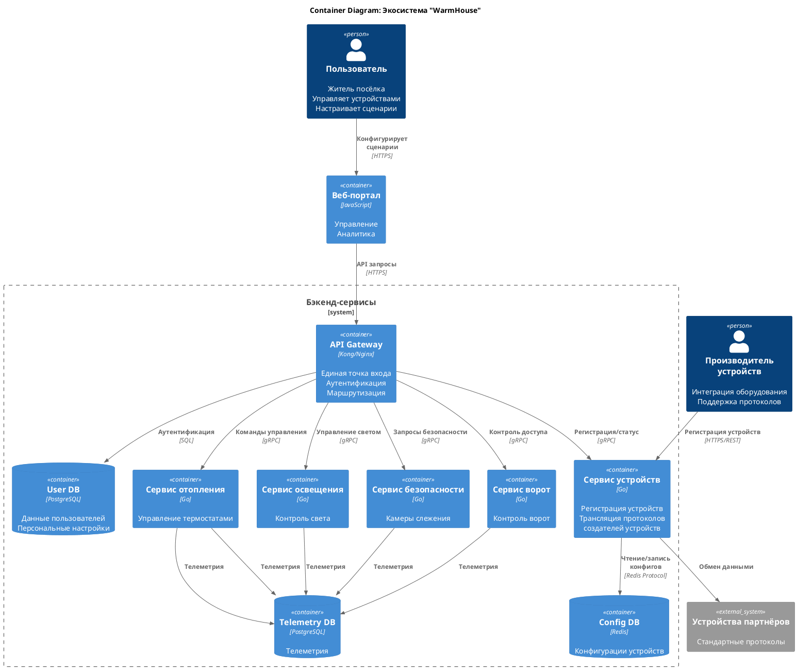
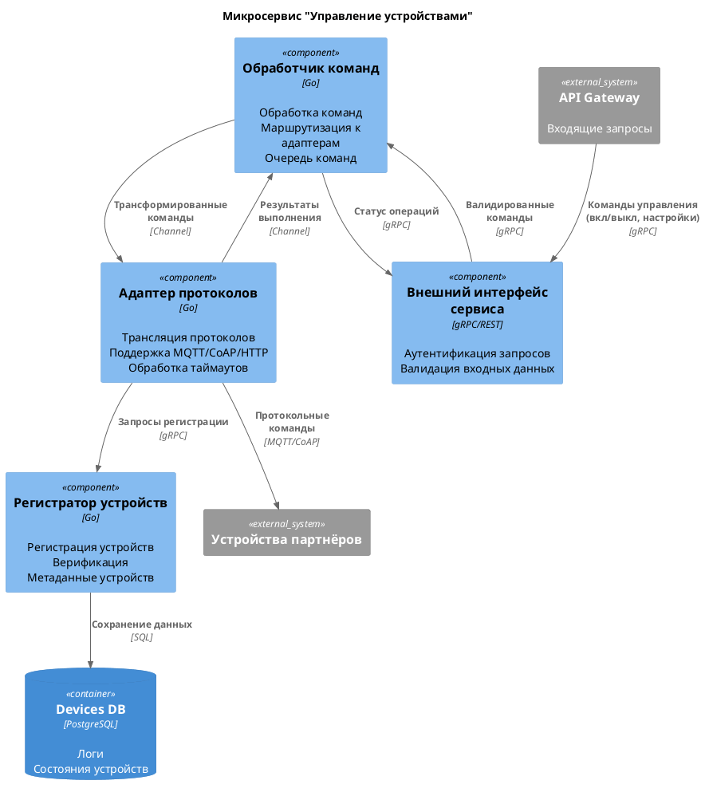
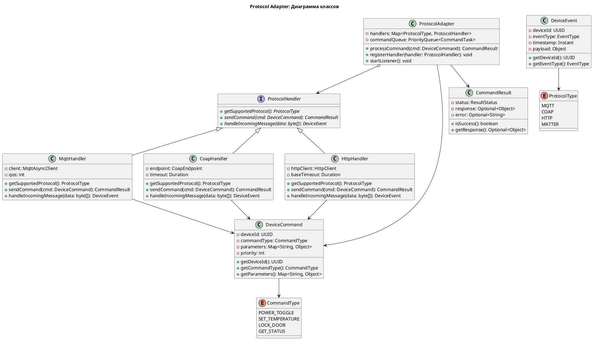
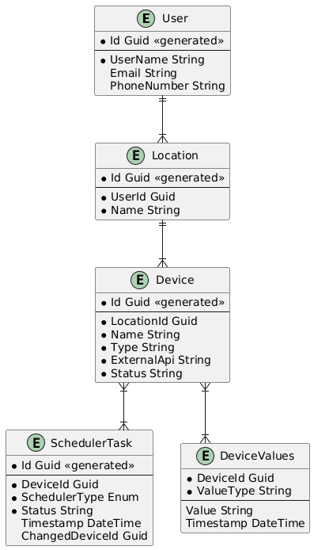

# Project_template

Это шаблон для решения проектной работы. Структура этого файла повторяет структуру заданий. Заполняйте его по мере работы над решением.

# Задание 1. Анализ и планирование

<aside>

Чтобы составить документ с описанием текущей архитектуры приложения, можно часть информации взять из описания компании и условия задания. Это нормально.

</aside

### 1. Описание функциональности монолитного приложения

**Управление отоплением:**

- Пользователи могут удалённо включать/выключать отопление в своих домах.

**Мониторинг температуры:**

- Система получает данные о температуре с датчиков, установленных в домах.
- Пользователи могут просматривать текущую температуру в своих домах через веб-интерфейс.

### 2. Анализ архитектуры монолитного приложения

- Язык программирования: Go
- База данных: PostgreSQL
- Архитектура: Монолитная, все компоненты системы (обработка запросов, бизнес-логика, работа с данными) находятся в рамках одного приложения.
- Взаимодействие: Синхронное, запросы обрабатываются последовательно.
- Масштабируемость: Ограничена, так как монолит сложно масштабировать по частям.
- Развертывание: Требует остановки всего приложения.

### 3. Определение доменов и границы контекстов

Домен: Управление устройствами

    Поддомен: Управление отоплением

        Контекст: Включение/выключение отопления

    Поддомен: Мониторинг температуры

        Контекст: Сбор и отображение данных о текущей температуре

### **4. Проблемы монолитного решения**

- Проблемы с тестированием и развёртыванием. Из-за монолитной структуры сложно изолировать отдельные функции для тестирования. Автоматизация CI/CD усложняется необходимостью проходить полный набор тестов при любой правке.

- Ограниченная масштабируемость. Все функции, такие как управление отоплением, сбор телеметрии и веб-интерфейс, собраны в одном исполняемом файле. Чтобы повысить производительность хотя бы одной из этих функций, нужно масштабировать всё приложение целиком.

- Отсутствие приоритизации ресурсов. Невозможно выделить отдельные ресурсы для часто используемых и редко используемых функций, чтобы оптимизировать использование CPU, памяти и сетевых ресурсов.

- Тесная зависимость компонентов. Изменения в одной части системы могут непреднамеренно повлиять на другие её части.

- Синхронная архитектура. Все запросы к датчикам и реле происходят по синхронному принципу: сервер ожидает ответа от устройства перед тем, как продолжить обработку. Это может привести к блокировке запросов при медленном или ненадёжном соединении и снижению производительности системы.

- Отсутствие возможности самостоятельного обслуживания. Для подключения нового датчика или реле необходим выезд специалиста. Пользователь не может самостоятельно добавить устройства или расширить функциональность системы.

- Единая база данных. Все данные системы, включая доменные и телеметрические, хранятся в одной базе данных PostgreSQL, что затрудняет разграничение нагрузки.

- Долгий цикл выпуска. Обновления требуют пересборки и перезапуска всего приложения, что удлиняет время на внедрение изменений.

- Низкая отказоустойчивость. Сбой в любой из частей системы приводит к её полной недоступности, а не только к изоляции проблемы в одном микросервисе.

- Ограниченная гибкость в расширении. Добавление новых функций, например, освещения, ворот или видеонаблюдения, требует изменений в основном ядре монолита, что усложняет код и увеличивает взаимозависимость между различными модулями.

### 5. Визуализация контекста системы — диаграмма С4



Исходный код диаграммы:
[container.puml](diagrams/context-diagram-simple.puml)

# Задание 2. Проектирование микросервисной архитектуры

**Диаграмма контейнеров (Containers)**



**Диаграмма компонентов (Components)**



**Диаграмма кода (Code)**



# Задание 3. Разработка ER-диаграммы



# Задание 4. Создание и документирование API

[Документация Device Service: REST API (OpenAPI)](apps/smart_home/api/device-management-api.yaml)

**Пример вызова**

Регистрация нового устройства:

```
http
POST /devices
Content-Type: application/json

{
  "serialNumber": "SN-TH-001",
  "typeId": "f47ac10b-58cc-4372-a567-0e02b2c3d479",
  "houseId": "550e8400-e29b-41d4-a716-446655440000"
}
```

Ответ:

```
json
{
  "deviceId": "3fa85f64-5717-4562-b3fc-2c963f66afa6",
  "status": "ACTIVE",
  "firmwareVersion": "1.2.3"
}
```

[Документация Telemetry Service: AsyncAPI](apps/smart_home/api/telemetry-asyncapi.yaml)

**Пример вызова**

Публикация телеметрии (PUB, асинхронно):

```
json
{
  "deviceId": "3fa85f64-5717-4562-b3fc-2c963f66afa6",
  "timestamp": "2023-10-05T14:30:00Z",
  "metrics": [
    {"name": "temperature", "value": 22.5},
    {"name": "power", "value": 45.6}
  ]
}
```

# Задание 5. Работа с docker и docker-compose

Перейдите в apps.

Там находится приложение-монолит для работы с датчиками температуры. В README.md описано как запустить решение.

Вам нужно:

1) сделать простое приложение temperature-api на любом удобном для вас языке программирования, которое при запросе /temperature?location= будет отдавать рандомное значение температуры.

Locations - название комнаты, sensorId - идентификатор названия комнаты

```
	// If no location is provided, use a default based on sensor ID
	if location == "" {
		switch sensorID {
		case "1":
			location = "Living Room"
		case "2":
			location = "Bedroom"
		case "3":
			location = "Kitchen"
		default:
			location = "Unknown"
		}
	}

	// If no sensor ID is provided, generate one based on location
	if sensorID == "" {
		switch location {
		case "Living Room":
			sensorID = "1"
		case "Bedroom":
			sensorID = "2"
		case "Kitchen":
			sensorID = "3"
		default:
			sensorID = "0"
		}
	}
```

2) Приложение следует упаковать в Docker и добавить в docker-compose. Порт по умолчанию должен быть 8081

3) Кроме того для smart_home приложения требуется база данных - добавьте в docker-compose файл настройки для запуска postgres с указанием скрипта инициализации ./smart_home/init.sql

Для проверки можно использовать Postman коллекцию smarthome-api.postman_collection.json и вызвать:

- Create Sensor
- Get All Sensors

Должно при каждом вызове отображаться разное значение температуры

